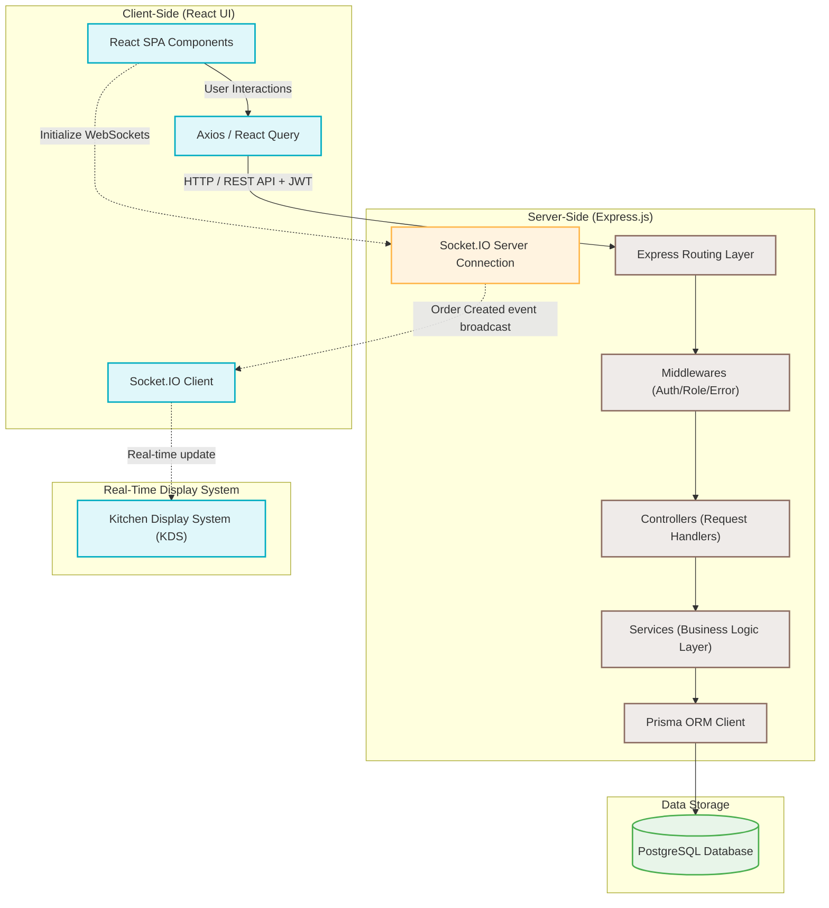
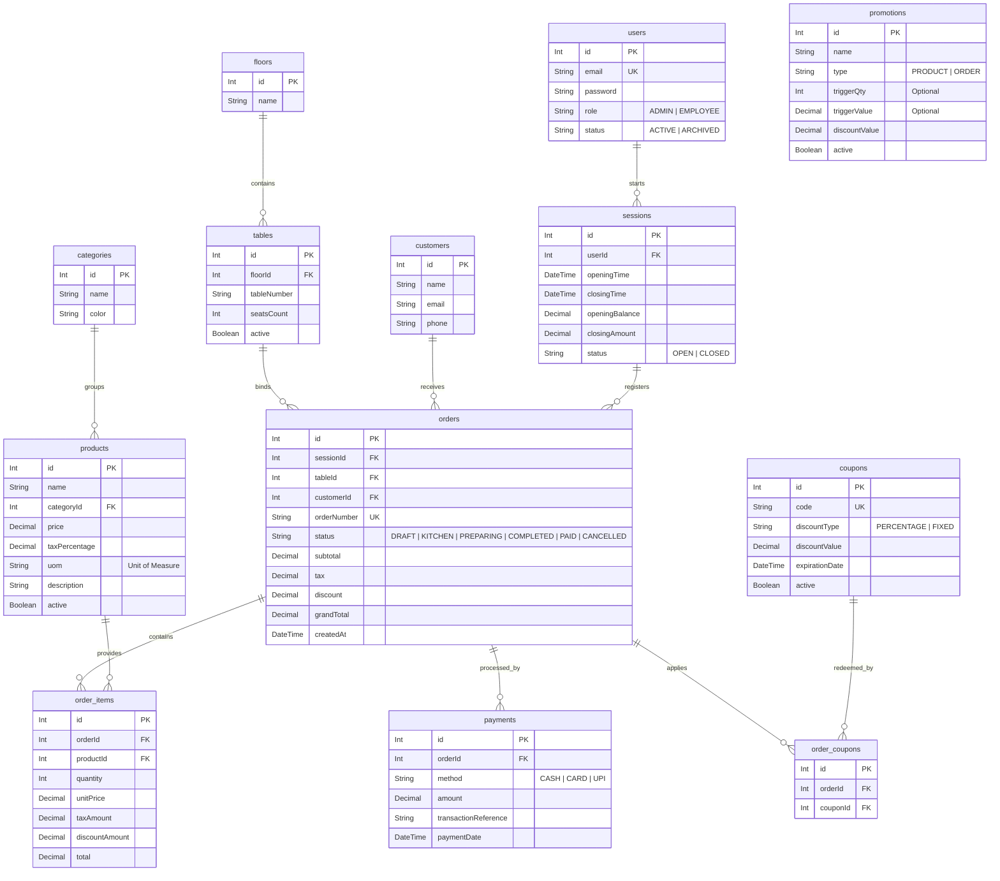
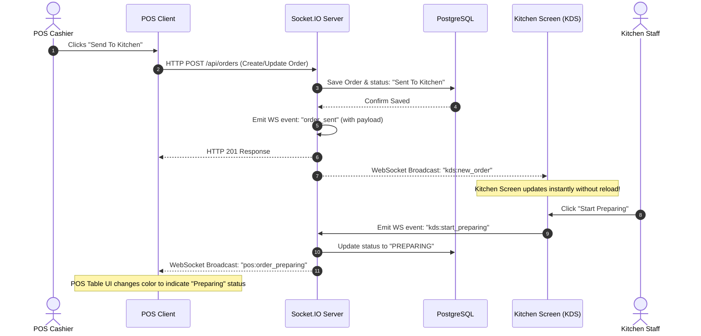
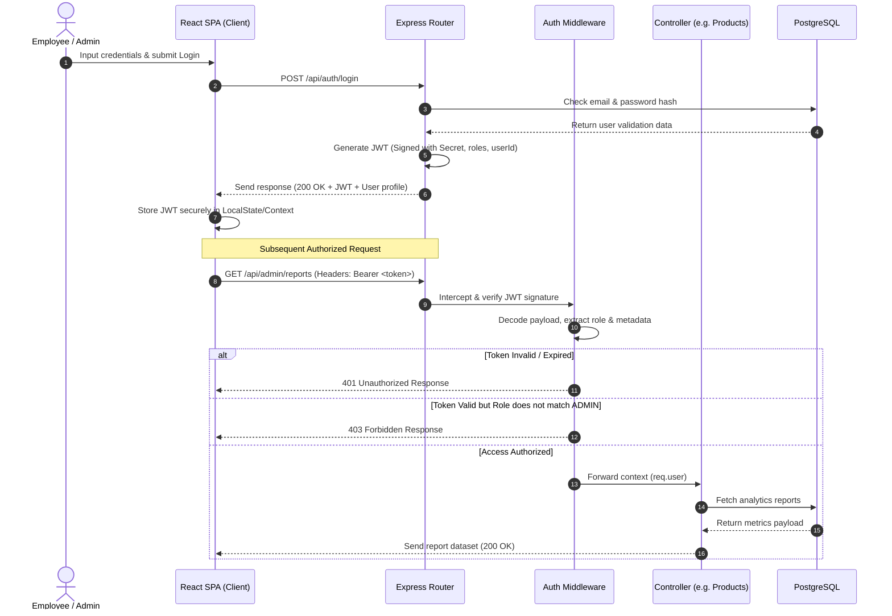

# Cafe POS System - Project Structure & Architecture Diagram

This document provides a professional, structured overview of the full-stack Cafe Point of Sale (POS) system. It details the frontend and backend directory maps, database schema relationships, system architecture, and operational data flows.

---

## 🏗️ System Architecture & Communication Flow

The system follows a modern decoupled frontend/backend architecture with real-time bidirectional syncing.



---

## 📂 Directory Map & Project Structure

The project is split into standard `client/` (frontend representation) and `server/` (backend logic) folders.

### 💻 Client Directory (React + Vite)

```
client/
│
├── 📂 public/               # Static public assets (favicons, browser manifest)
│
└── 📂 src/
    │
    ├── 📂 assets/           # Global design resources (images, SVGs, static files)
    │
    ├── 📂 components/       # Reusable React components
    │   ├── 📂 ui/           # Low-level primitives (Buttons, Inputs, Badges, Modals)
    │   ├── 📂 forms/        # Form handlers, validations, inputs
    │   ├── 📂 layout/       # App layout frameworks (Sidebar, Header, KDS shell)
    │   └── 📂 tables/       # Interactive tables (Sortable, Searchable, Paginated grids)
    │
    ├── 📂 pages/            # Router page views representing logical features
    │   ├── 📂 Login/        # Cashier & Admin authentication gateway
    │   ├── 📂 Dashboard/    # Management dashboard containing sales KPIs
    │   ├── 📂 Categories/   # Product categorization management
    │   ├── 📂 Products/     # Menu product editor and list views
    │   ├── 📂 Floors/       # Cafe seating floor controller
    │   ├── 📂 Tables/       # Seat & table count konfigurator
    │   ├── 📂 Customers/    # Customer CRM, search, and directory
    │   ├── 📂 Orders/       # Past orders list & receipt lookup tool
    │   ├── 📂 POS/          # POS Terminal screen (Live Cart, Product grid, table selector)
    │   ├── 📂 Kitchen/      # Kitchen Display System (KDS) queue screen
    │   ├── 📂 Payments/     # Checkout and receipt printing/email operations
    │   └── 📂 Reports/      # Business reports interface (Exports, trends)
    │
    ├── 📂 services/         # Modular REST API interaction layers (Axios instances)
    │   ├── 📄 authService.js
    │   ├── 📄 categoryService.js
    │   ├── 📄 productService.js
    │   ├── 📄 orderService.js
    │   └── 📄 paymentService.js
    │
    ├── 📂 hooks/            # Custom reusable React and React Query hooks
    ├── 📂 context/          # Global state wrappers (Auth, Cart state, POS session)
    ├── 📂 routes/           # Routing configuration, path links, and route guards
    ├── 📂 utils/            # Helper scripts (formatting currency, calculating totals)
    │
    ├── 📄 App.jsx           # Root routing and application context shell
    └── 📄 main.jsx          # React virtual DOM bootstrap entry point
```

### ⚙️ Server Directory (Node.js + Express)

```
server/
│
├── 📂 prisma/               # Prisma schema modeling directory
│   └── 📄 schema.prisma     # DB connections, schema tables definition & ORM settings
│
└── 📂 src/
    │
    ├── 📂 config/           # Database & platform config loaders
    │   ├── 📄 database.js   # DB connection options
    │   ├── 📄 prisma.js     # Shared Prisma Client initializer instance
    │   └── 📄 socket.js     # Socket.IO connection configurations
    │
    ├── 📂 controllers/      # Route request/response orchestrator controllers
    │   ├── 📄 authController.js
    │   ├── 📄 categoryController.js
    │   ├── 📄 productController.js
    │   ├── 📄 customerController.js
    │   ├── 📄 orderController.js
    │   ├── 📄 paymentController.js
    │   └── 📄 reportController.js
    │
    ├── 📂 services/         # Isolated heavy business logic algorithms
    │   ├── 📄 authService.js
    │   ├── 📄 orderService.js
    │   ├── 📄 paymentService.js
    │   └── 📄 reportService.js
    │
    ├── 📂 middlewares/      # HTTP request lifecycle pipeline hooks
    │   ├── 📄 authMiddleware.js   # Extracts, validates, and decodes JWT tokens
    │   ├── 📄 roleMiddleware.js   # Checks roles (ADMIN, EMPLOYEE) for resource gates
    │   └── 📄 errorMiddleware.js  # Global express central error formatting controller
    │
    ├── 📂 routes/           # Endpoint definition routes
    │   ├── 📄 authRoutes.js
    │   ├── 📄 categoryRoutes.js
    │   ├── 📄 productRoutes.js
    │   ├── 📄 customerRoutes.js
    │   ├── 📄 orderRoutes.js
    │   ├── 📄 paymentRoutes.js
    │   └── 📄 reportRoutes.js
    │
    ├── 📂 sockets/          # Socket connection registers
    │   └── 📄 kitchenSocket.js    # Relays orders instantly to the KDS
    │
    ├── 📂 validations/      # Validation schemas for incoming payloads (Joi/Zod)
    │
    ├── 📄 app.js            # Express core framework instantiation
    └── 📄 server.js         # Port listener, websocket attachment, server trigger
```

---

## 💾 Database Entity-Relationship Diagram (PostgreSQL)

The database models are designed for relational stability, supporting audit trails (sessions), discounts, and orders.



---

## ⚡ Real-Time Synchronization Flow (Socket.IO KDS)

When an order is updated, details are instantaneously synced across terminals.



---

## 🔒 Authentication Flow (JWT Validation)

Authenticating requests ensures strict access controls over POS operations and admin stats.



---

## 🔄 Cafe POS Business Operations Flow

The life cycle of restaurant transactions from session start to metrics reporting:

```mermaid
graph LR
    classDef step fill:#e1f5fe,stroke:#0288d1,stroke-width:1.5px;
    classDef done fill:#c8e6c9,stroke:#388e3c,stroke-width:1.5px;

    Start([Start Shift]) --> Login[Employee Login]:::step
    Login --> OpenSession[Open Session & Opening Cash]:::step
    OpenSession --> TableGrid[Select Floor & Table]:::step
    TableGrid --> CartOps[Create Order & Select Products]:::step
    CartOps --> CheckoutOpts{Apply discount/promo?}:::step
    
    CheckoutOpts -- Coupon Code --> AddCoupon[Verify & Apply Discount]:::step
    CheckoutOpts -- Automatic Promo --> AddPromo[Calculate Promo Discount]:::step
    CheckoutOpts -- Standard pricing --> KitchenFlow[Send To Kitchen]:::step
    
    AddCoupon --> KitchenFlow
    AddPromo --> KitchenFlow
    
    KitchenFlow --> KDSQueue[KDS updates via Socket.IO]:::step
    KDSQueue --> Prep[Kitchen Staff Prepares Meal]:::step
    Prep --> Pay[Complete Prep & Process Payment]:::step
    
    Pay --> Receipt[Print/Email Invoice & Receipt]:::step
    Receipt --> ShiftEnd{End of Shift?}:::step
    
    ShiftEnd -- No --> TableGrid
    ShiftEnd -- Yes --> CloseSession[Generate Session Report & Close Session]:::done
    CloseSession --> AdminReports[Admin reviews Analytics Reports]:::done
```


